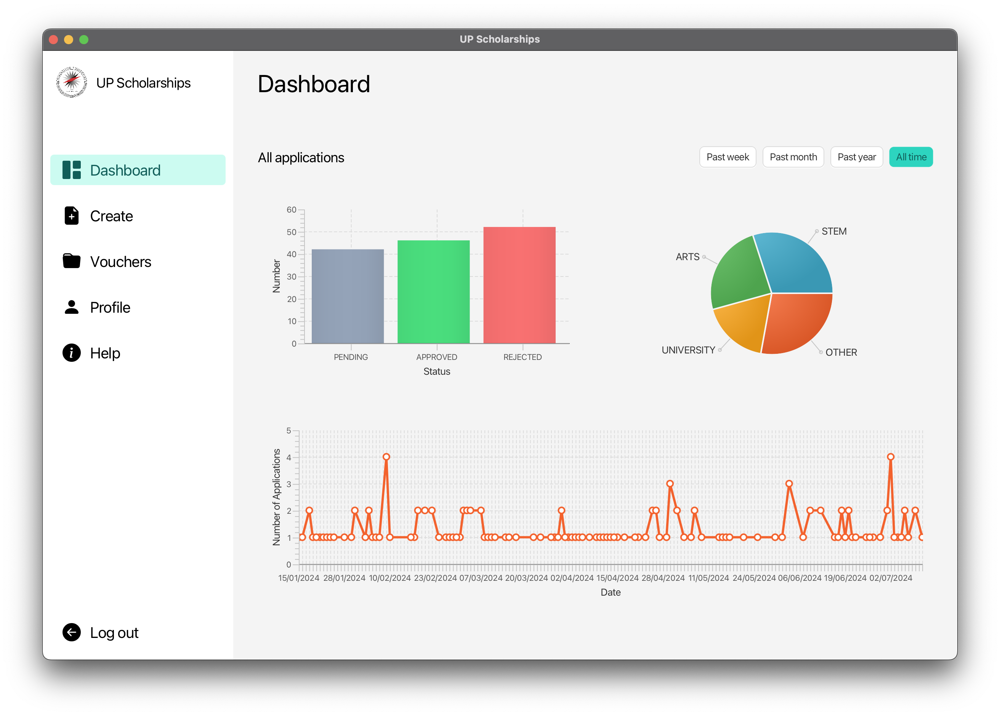
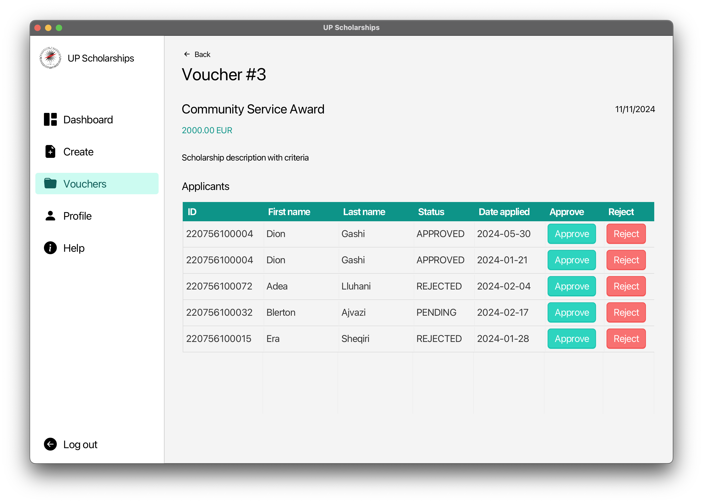
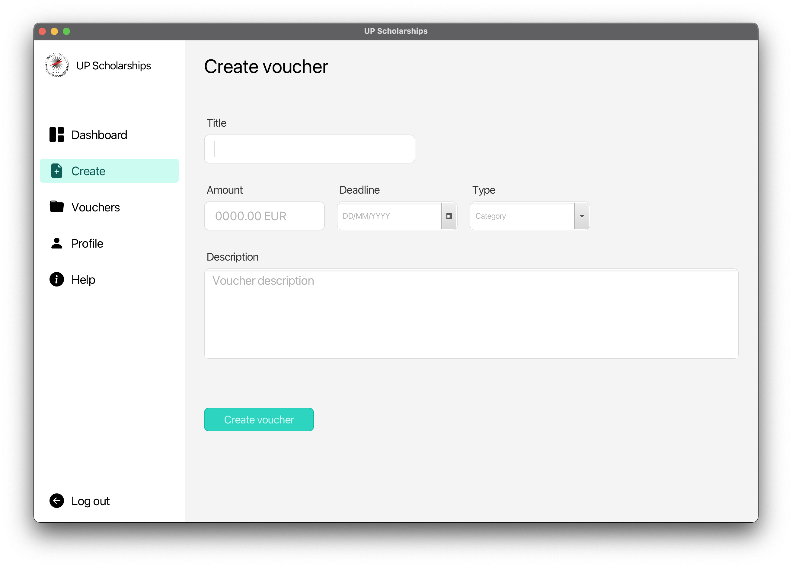

# UP Scholarships

Desktop app for applying for and managing scholarships for the University of Prishtina. Project build with JavaFX and MySQL.

## Getting Started

Clone the repository
```bash
git clone https://www.github.com/gjonhajdari/up-scholarships
cd up-scholarships/src
```

### Set Up the Database

Open your terminal and access the MySQL CLI to run the database scripts

```bash
mysql -u root -p < src/main/db-structure.sql
```

Replace `root` with your MySQL username if you have it configured differently. You will be prompted to enter your password (if you don't have one just hit enter).

#### Add all student accounts

You can add all the test accounts by running the `Migration.java` file. It creates accounts using the student data from the `students.csv` file.

Run the `db-testData.sql` script to add the test data to the database.

```bash
mysql -u root -p < src/main/db-testData.sql
```

Alternatively you can open the sql scripts and run them in your favorite MySQL GUI.

### Configure Database Connection

If your MySQL environment is configured differently, you can change the connection details in the `ConnectionUtil.java` file. If it isn't, you can skip this step.
```java
// File: ConnectionUtil.java

public class ConnectionUtil {
  // ...
  private static String URL = "jdbc:mysql://localhost:[port]/scholarships";
  private static String USER = [username];
  private static String PASSWORD = [password];
  // ...
}
```

## Screenshots

Admin dashboard page


Voucher page with a list of applicants


Create voucher page


## Dependencies

| Name                                                               | Version |
|------------------------------------------------------------------- |---------|
| [Java](https://www.oracle.com/java/technologies/downloads/#java22) | 22      |
| [MySQL](https://www.mysql.com/downloads/)                          | 8.3.0   |

## Contributors

University team project for the Human-Computer Interaction course at the [University of Prishtina](https://fiek.uni-pr.edu).

<a href="https://github.com/gjonhajdari/up-scholarships/graphs/contributors">
  
</a>

Made with [contrib.rocks](https://contrib.rocks).
